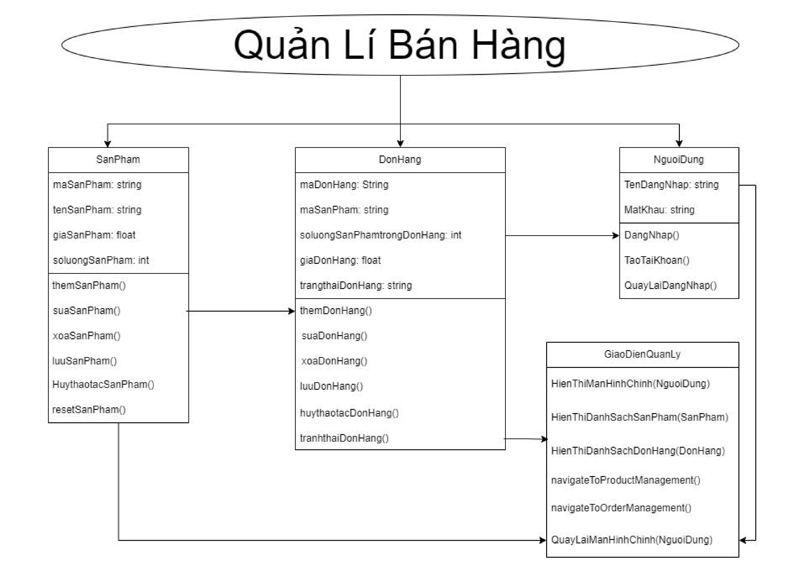
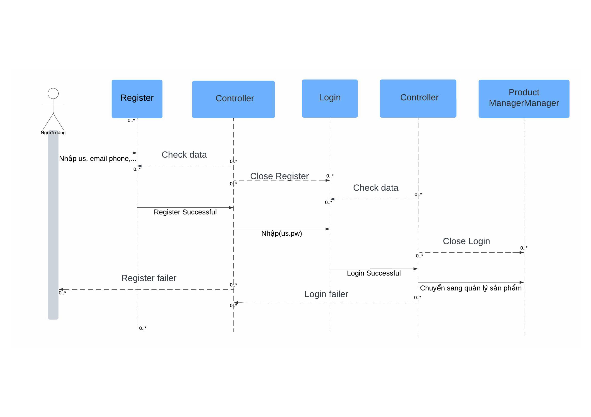
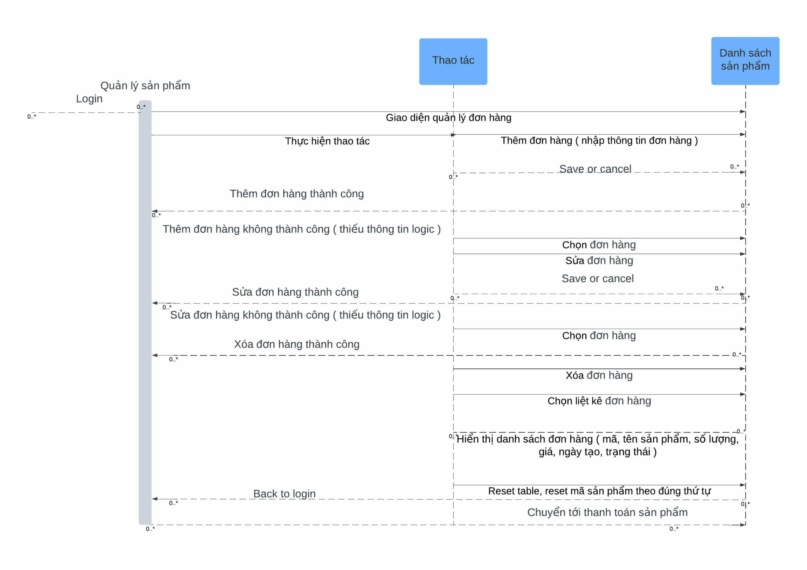
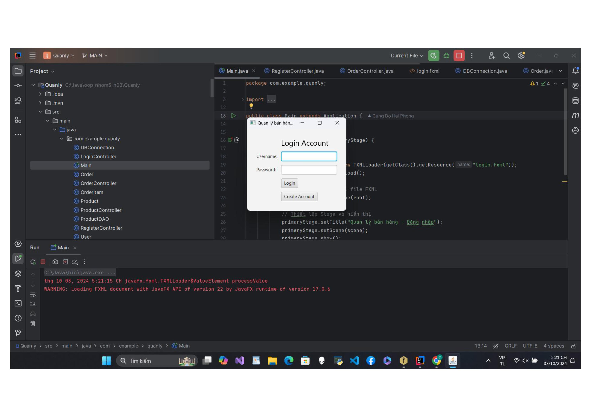

<<<<<<< Updated upstream >>>>>>>
GROUP_5-OOP-N03 
# Hệ Thống Quản Lý Bán Hàng

## Giới Thiệu Dự Án
Dự án này là một hệ thống quản lý bán hàng, giúp tối ưu hóa và cải thiện hiệu quả hoạt động của các cửa hàng. Hệ thống cho phép quản lý sản phẩm cũng như đơn hàng.
## Thành Viên Nhóm

- **Cung Đỗ Hải Phong**: Phát triển phần mềm toàn diện.

## Chức Năng Chính
- Thêm, sửa, xoá sản phẩm
- Thêm, sửa, xoá đơn hàng
- Lấy thông tin sản phẩm
- Lấy thông tin đơn hàng
- Thêm sản phẩm vào đơn hàng(Order)
- Xoá sản phẩm khỏi đơn hàng

## UML Dự Án

## 1.1 UML Component Diagram

## 1.2 UML Sequence Diagram

## 1.2.1 

## 1.2.2

.jpg)

## 1.2.3

## 1.2.4

## Giao diện đầu tiên của dự án

=======

>>>>>>> Stashed changes
